# Phần mềm Quản lý Trung tâm Đào tạo (Education Center Management System)

## Tổng quan dự án
Đây là giải pháp phần mềm quản lý toàn diện dành cho các trung tâm giáo dục, được xây dựng trên nền tảng **Windows Forms (.NET)**. Hệ thống giúp thay thế quy trình quản lý thủ công, tối ưu hóa việc xếp thời khóa biểu, quản lý học vụ và kiểm soát doanh thu tài chính chính xác.

Phần mềm giải quyết các bài toán cốt lõi: Quản lý hồ sơ lượng lớn học viên, xử lý xếp lịch học tránh trùng lặp và minh bạch hóa tài chính.

## Công nghệ kỹ thuật
Dự án áp dụng mô hình kiến trúc 3 lớp (3-Tier Architecture) đảm bảo tính bảo trì và mở rộng.

- **Ngôn ngữ:** C#
- **Nền tảng:** .NET Framework (Windows Forms)
- **Cơ sở dữ liệu:** Microsoft SQL Server
- **Công cụ:** Visual Studio 2022
- **Thư viện:** Microsoft Report Viewer (Xuất báo cáo), QRCoder (Tạo mã thanh toán).

---

## 📸 Hình ảnh & Chức năng chi tiết

### 1. Dashboard Quản trị
Trung tâm điều khiển hiển thị cái nhìn tổng quan về tình hình hoạt động của trung tâm: số lượng học viên, lớp học và biểu đồ tài chính.
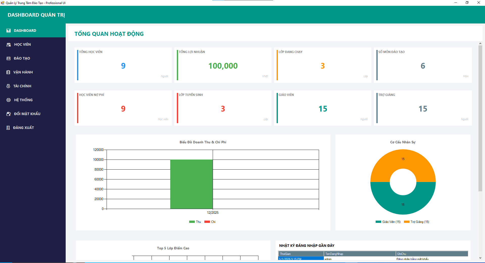

### 2. Quản lý Hồ sơ & Đào tạo
Hệ thống lưu trữ và quản lý thông tin chi tiết, hỗ trợ tìm kiếm và thao tác nghiệp vụ nhanh chóng.

**Quản lý thông tin Học viên & Nhân sự:**

  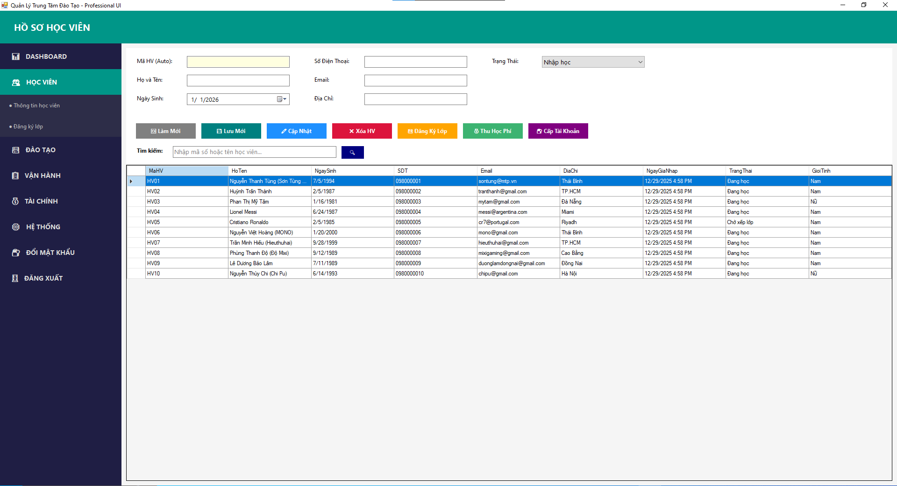
  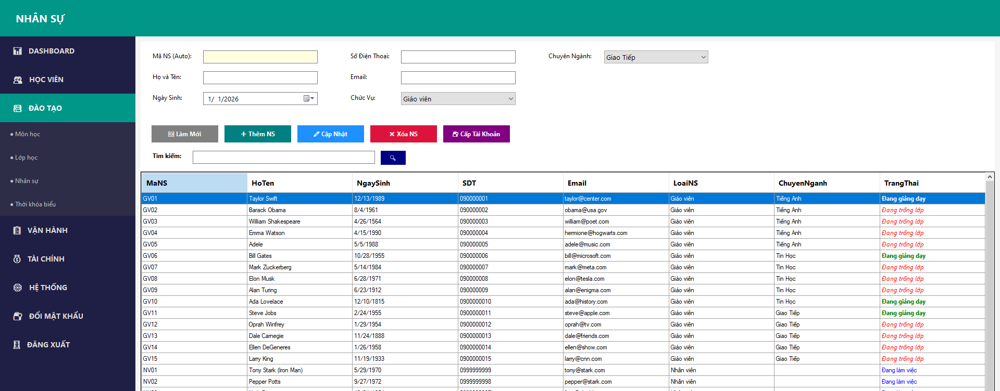 

**Thiết lập Môn học & Lớp học:**

  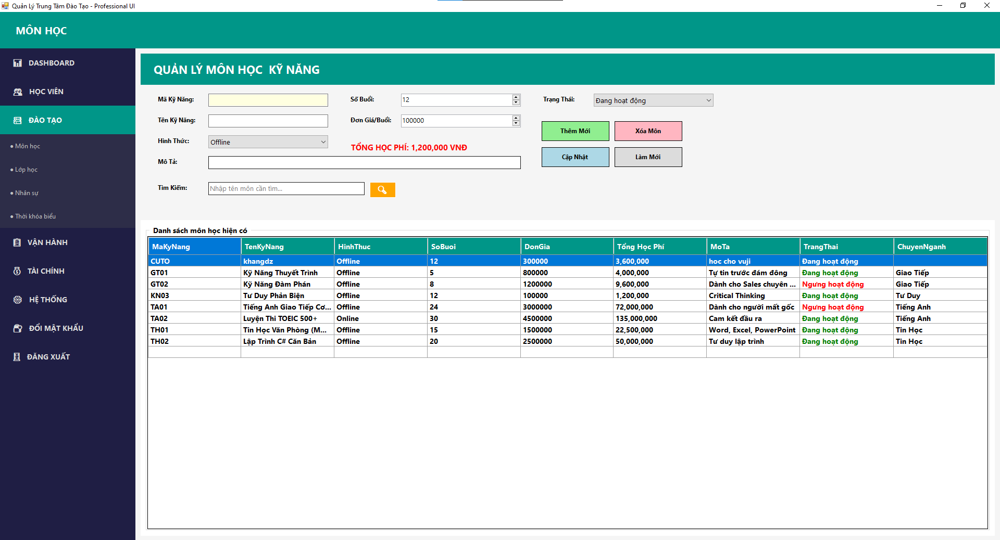
  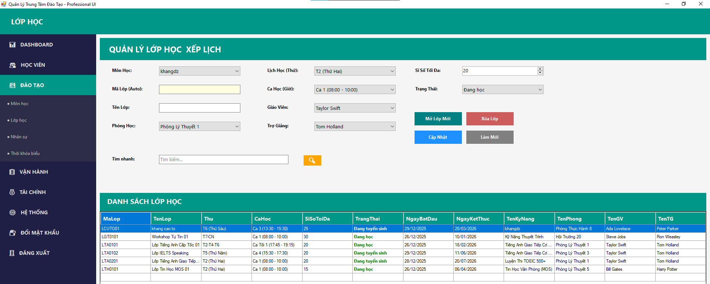 

### 3. Nghiệp vụ Xếp lịch & Đăng ký
Chức năng cốt lõi giúp điều phối lịch học và đăng ký lớp cho học viên.

- **Đăng ký lớp học (DkClass):** Giao diện xử lý việc ghi danh học viên vào lớp.
- **Thời khóa biểu:** Hệ thống hiển thị lịch học trực quan, hỗ trợ phát hiện trùng lịch.

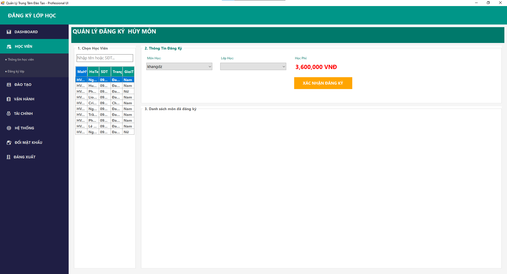
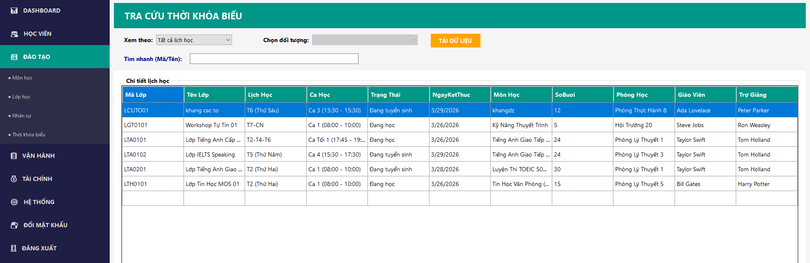

### 4. Vận hành Lớp học
Công cụ dành cho Giáo vụ/Giảng viên để theo dõi tiến độ học tập.

- **Điểm danh:** Check-in nhanh tình trạng vắng/có mặt của học viên theo buổi.
- **Quản lý điểm:** Nhập điểm thành phần và tự động tính kết quả xếp loại.

  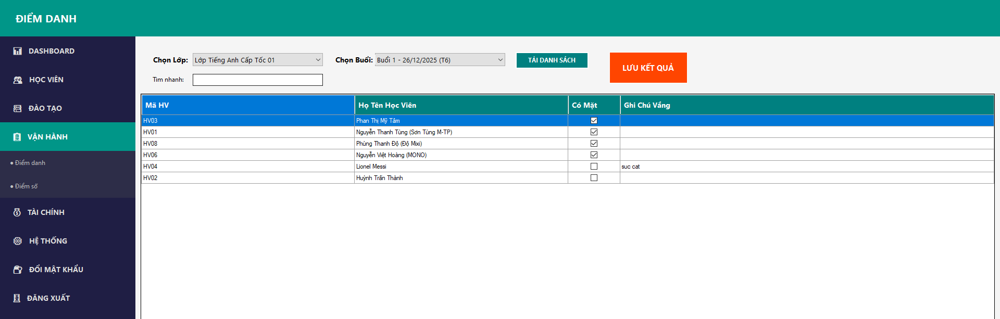
  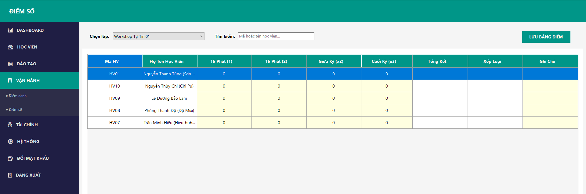 

### 5. Tài chính & Báo cáo
Minh bạch hóa dòng tiền và hỗ trợ thu phí hiện đại.

- **Thu học phí:** In hóa đơn và tạo mã QR thanh toán.
- **Báo cáo tài chính:** Thống kê doanh thu chi tiết.

  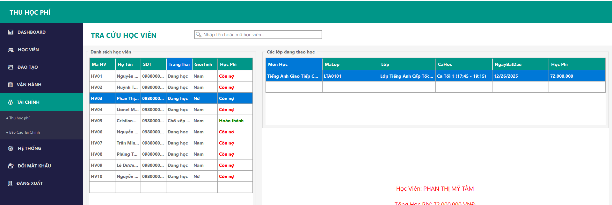
  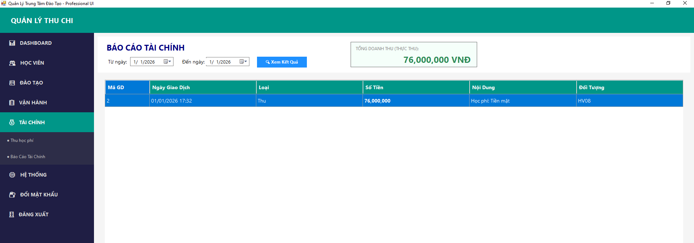 

---

## Hướng dẫn cài đặt
1. **Cơ sở dữ liệu:**
   - Mở SQL Server Management Studio.
   - Chạy file script `Database/Script.sql` để khởi tạo cấu trúc bảng và dữ liệu mẫu.
2. **Cấu hình:**
   - Mở file `App.config` trong solution.
   - Cập nhật `connectionStrings` tương ứng với tên Server của bạn.
3. **Khởi chạy:**
   - Mở file `.sln` bằng Visual Studio và nhấn **Start**.

## Thông tin tài khoản Demo
| Vai trò | Username | Password |
| :--- | :--- | :--- |
| **Admin** | `admin` | `123` |
| **Giáo vụ** | `giaovu01` | `123` |
| **Học viên** | `HV06` | `1` |

---
**Tác giả:** Nhóm gồm 4 thành viên:
-Trần Minh Khang
-Lê Viết Huy
-Phạm Gia Huy
-Nguyễn Phi Phúc

